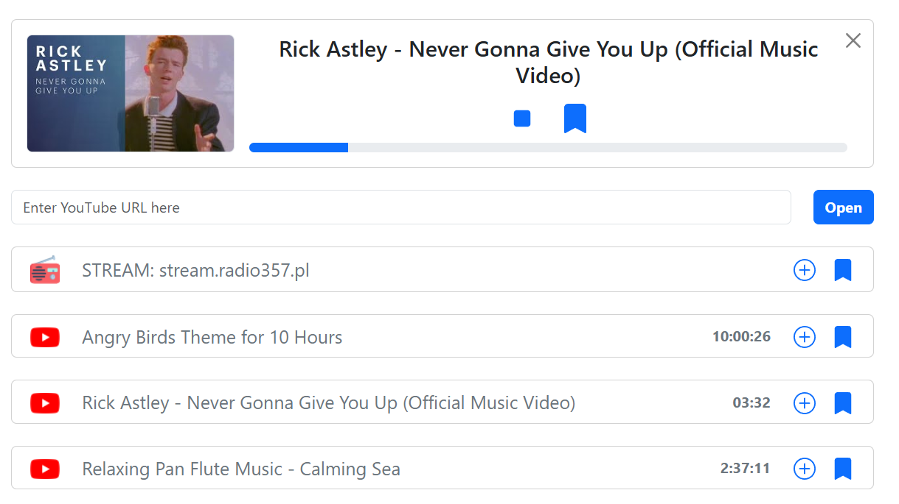

# RadioPI

This project is a self-hosted panel for RaspberryPi FM transmitter tool.
It allows broadcasting YouTube videos and audio streams as FM radio.

## Disclaimer
I've created this project for my own needs and educational purposes. 
It is not intended for production use, hence the installation is rather complex, but I am leaving it here for anyone who might find it useful.

## Features

- Fetch and play YouTube videos
- Transmit direct audio streams e.g. online radio stations
- Add video bookmarks
- REST API for controlling video playback and managing bookmarks

## Technologies Used

### Backend
- Node.js + Express.js
- MySQL
- ffmpeg
- yt-dlp
- fm_transmitter

### Frontend
- React + Vite
- Bootstrap

## Requirements

Project requires a Raspberry Pi (up to 4) with MySQL, Node.js and npm installed.

This project relies on 3 command line tools:
- **ffmpeg** (for audio processing) https://ffmpeg.org/
- **yt-dlp** (extracting youtube video stream) https://github.com/yt-dlp/yt-dlp
- **fm_transmitter** (for transmitting fm signal using raspberry pi) https://github.com/markondej/fm_transmitter

## Installation

1. Clone the repository:
    ```sh
    git clone https://github.com/Cubixor/RadioPi
    cd RadioPi
    ```

### Backend part

1. Navigate to the backend directory:
    ```sh
    cd server
    ```

2. Install dependencies:
    ```sh
    npm install
    ```

3. Set up the MySQL database and update the connection details in the `server.js`:
   ```sql
    CREATE TABLE `bookmarks`
    (
        `url`      varchar(255) NOT NULL,
        `type`     varchar(16)  NOT NULL,
        `title`    varchar(255) DEFAULT NULL,
        `duration` int(11)      DEFAULT NULL,
        PRIMARY KEY (`url`)
    )
   ```

4. Edit your MySQL database credentials in `server.js` file. Also edit the `FM_TRANSMITTER_PATH` variable to point to the place where you have fm_transmitter tool installed. 

### Frontend part
1. Navigate to the frontend directory:
    ```sh
    cd client
    ```
   
2. Install dependencies:
    ```sh
    npm install
    ```
3. Edit the `vite.config.js` file to set the correct backend URL (set correct address and port):
    ```js
    const config = {
        server: {
            proxy: {
                '/api': {
                    target: 'http://localhost:3000',
                    changeOrigin: true,
                },
            },
        },
    };
    ```
   
4. Build the frontend:
    ```sh
    npm run build
    ```
   
5. Copy the build files to the backend directory:
    ```sh
    cp -r dist/* ../server/public/
    ```
   
## Run the server
1. Navigate to the backend directory:
    ```sh
    cd server
    ```
2. Start the server:
    ```sh
    node server.js
    ```


## API Endpoints

- `GET /api/video?link=` - Fetch current video or provide a new link to play
- `DELETE /api/video` - Close current video
- `POST /api/video/play` - Start playing the current video
- `POST /api/video/stop` - Stop the current video
- `GET /api/bookmarks` - Get all saved bookmarks
- `POST /api/bookmark` - Save the current video as a bookmark
- `DELETE /api/bookmark?url=` - Delete a bookmark by URL

## Screenshots


